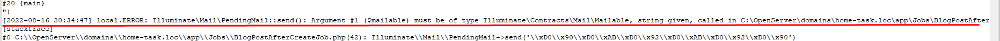
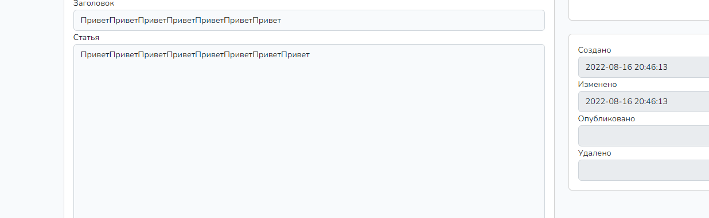
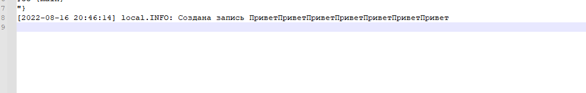
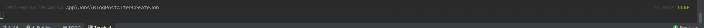

<h2>Задание 22</h2>
Были добавлены обесерверы для BlogPost и BlogCategory моделей
Создал таблицу очереди и создал job BlogPostAfterCreateJob 
отправка почты не отрабатывает в логах пишет что не правильный тип

Сделал запись в лог при создании поста

Скрины

ещё

