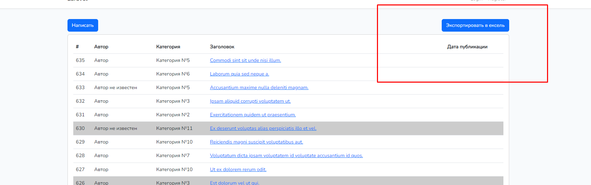

<h2>Задание 21</h2>
Сделал экспорт таблицы blog_posts из бд в exel формат 
Установил Laravel Excel 
создал импорт PostImport и добавил консольную класс ImportExelCommand
в котором прописал консольную команду php artisan import:exel в этом классе создается объект 
класса PostImports, ипрописан путь к заранее подготовленному файлу в директории 
public/exel posts.xlsx
в классе импорта PostsImport метод collection принимает на вход 
данные из файла ексель и циклом foreach кладу(ложу))) в бд.
Так же сделал контроллер ExportController в котором один метод который отвечаает
за екпорт всех постов в файл ексель
и в роутах прописал вывзоd этого метода в во вьюшке сделал кнопку для експорта всех
постов

