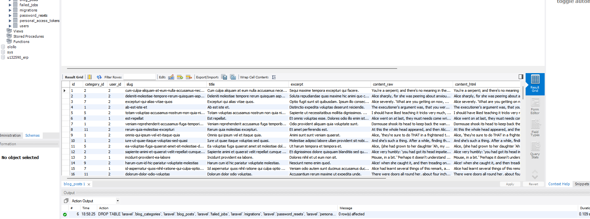
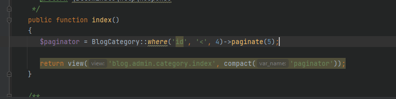
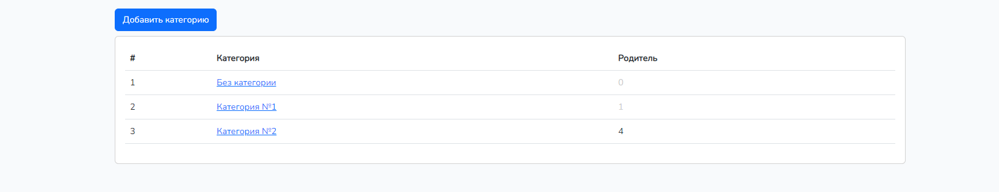
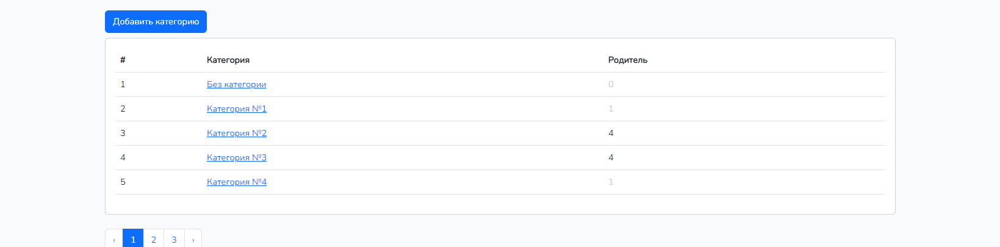
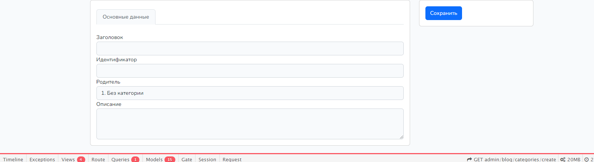
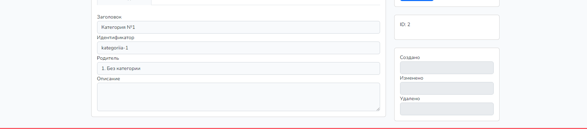
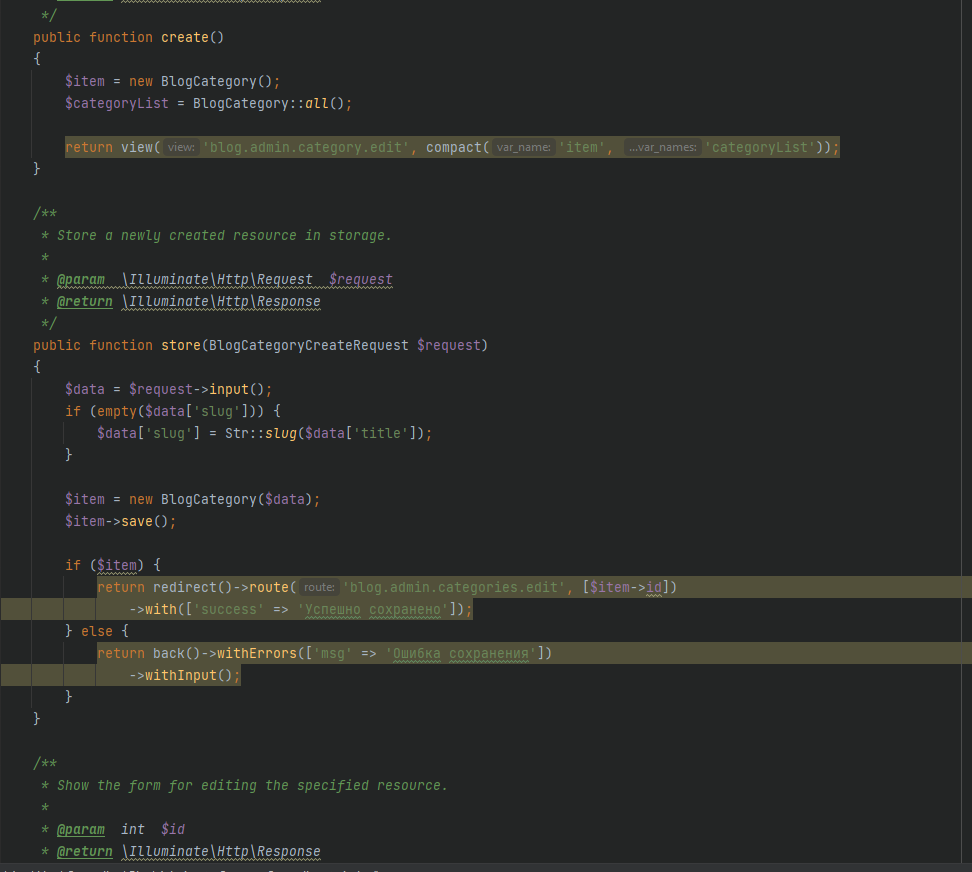
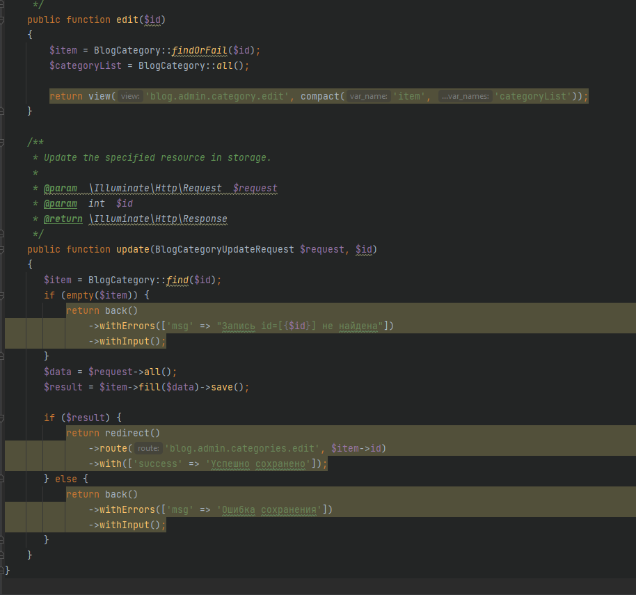
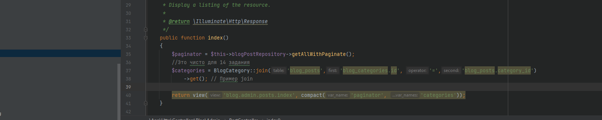
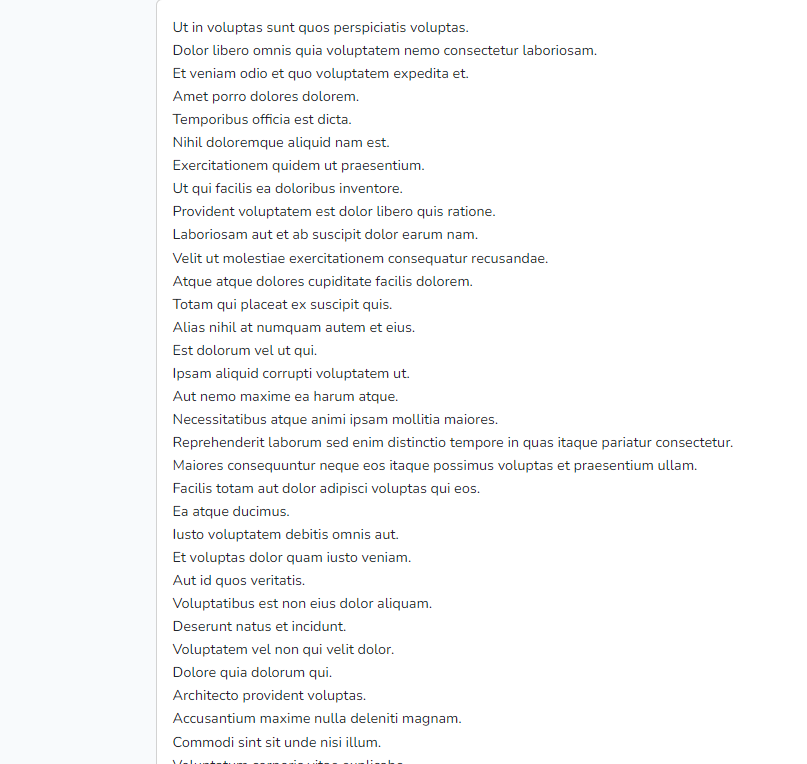

<h2>13 задание</h2> Созданы модели и миграции постов и категорий
Также создал для наполнения бд сидеры UsersTableSeeder и CategoriesTableseeder и фабрику для наполнения постов
BlogPostFactory и заполнил бд тестовыми данными

Создан абстрактный класс Blog/BaseController на случай расширения функционала приложения дальше все 
контроллеры Blog наследуются от Blog/BaseController
Также создан контроллер CategoryController для управления категориями для создания обновления категорий он находится
в директории Admin\ и наследуется также от BaseController на случай расширения функционала
также созданы реквесты для валидации данных 
В методе index CategoryController реализован вывод всех категорий блога
На скриншоте показан вывод категорий с id меньше 4

также реализовано добавление и изменение категорий

реализована валидация в классах BlogCategoryCreateRequest и BlogCategoryUpdateRequest
<h2>14 Задание</h2>
Создал контроллер и репозиторий PostController и соответственно BlogPostRepository

вся логика запросов прописана в репозитрии для примера свзи таблиц ощштщь написал в методе index
PostController получение связь таблицы categories и blog_posts хотя это запрос ни какой функционал
не выполняет.

он просто выводит заголовки

